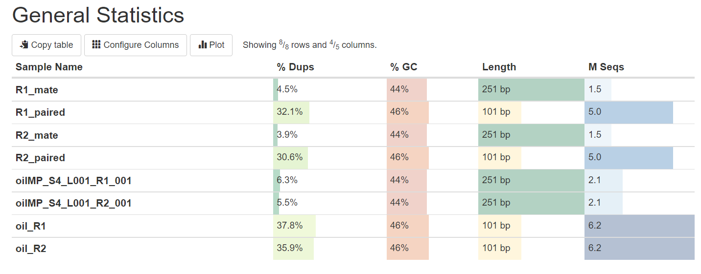
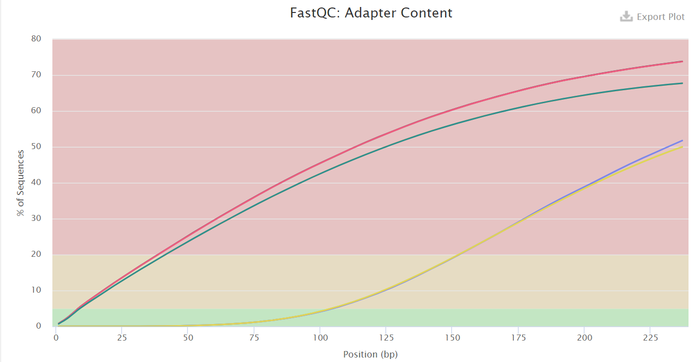
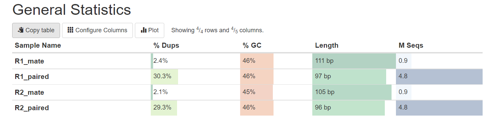
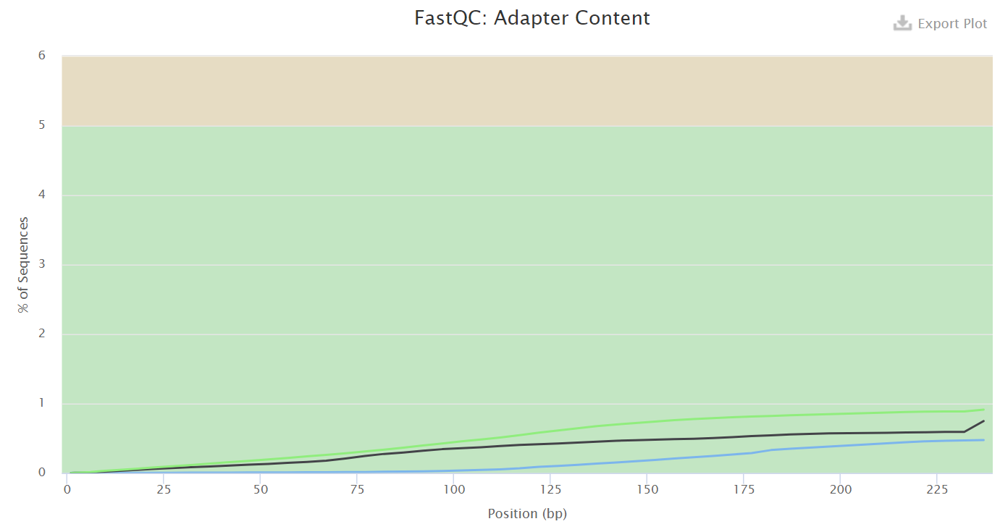
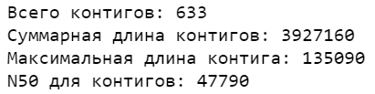
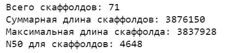
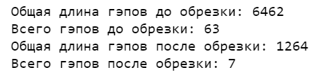

# hse21_hw1

## Команды на сервере

```
seqtk sample -s919 oil_R1.fastq 5000000 > R1_pair.fastq
seqtk sample -s919 oil_R2.fastq 5000000 > R2_pair.fastq
seqtk sample -s919 oilMP_S4_L001_R1_001.fastq 1500000 > R1_mate.fastq
seqtk sample -s919 oilMP_S4_L001_R2_001.fastq 1500000 > R2_mate.fastq

mkdir fastqc
ls *.fastq | xargs -P 4 -tI{} fastqc -o fastqc {}

mkdir multiqc
multiqc -o multiqc fastqc

platanus_trim R1_pair.fastq R2_pair.fastq 
platanus_internal_trim R1_mate.fastq R2_mate.fastq 

mkdir fastqctrim
ls *.fastq.trimmed | xargs -P 4 -tI{} fastqc -o fastqctrim {}
ls *.fastq.int_trimmed | xargs -P 4 -tI{} fastqc -o fastqctrim {}

multiqc -o multiqc fastqctrim

time platanus assemble -o Poil -t 2 -m 16 -f R1_pair.fastq.trimmed R2_pair.fastq.trimmed 2> assemble.log
time platanus scaffold -o Poil -t 2 -c Poil_contig.fa -IP1 R1_pair.fastq.trimmed R2_pair.fastq.trimmed -OP2 R1_mate.fastq.int_trimmed R2_mate.fastq.int_trimmed 2> scaffold.log
time platanus gap_close -o Poil -t 2 -c Poil_contig.fa -IP1 R1_pair.fastq.trimmed R2_pair.fastq.trimmed -OP2 R1_mate.fastq.int_trimmed R2_mate.fastq.int_trimmed 2> gapclose.log
```

## Результаты multiqc

### Исходные чтения


### После подрезки


## Постобработка
### Постобработка выполнена в src/analysis.ipynb



